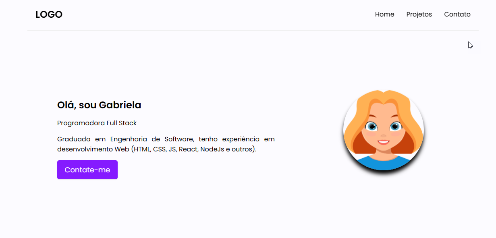
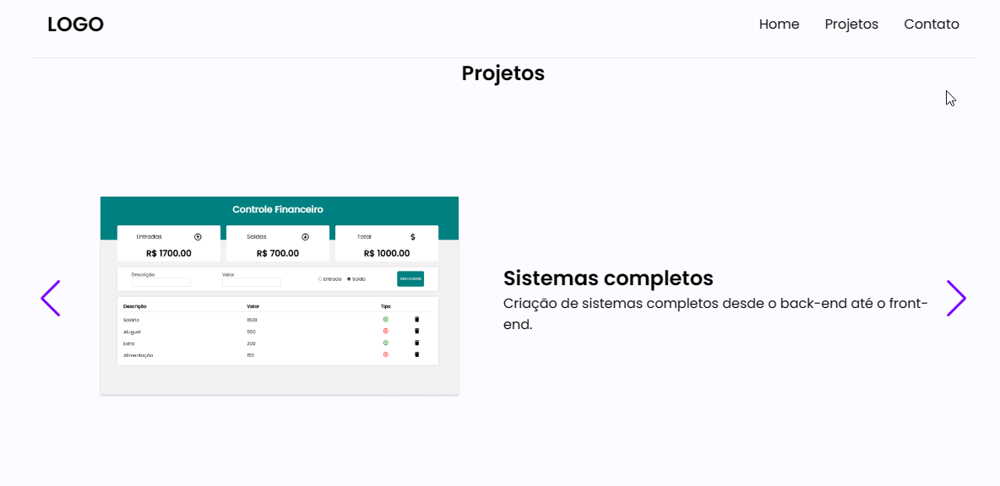

# Portfolio-Site
Um site portfólio para disponibilizar seus projetos.

Esse desafio tinha a finalidade de observar meus conhecimentos básicos em: 

<b>
• HTML  
• CSS  
• Javascript  
</b>

Visualização do site: https://portfolioprojetos.netlify.app

## Screenshots

  </img>
  

  </img>

